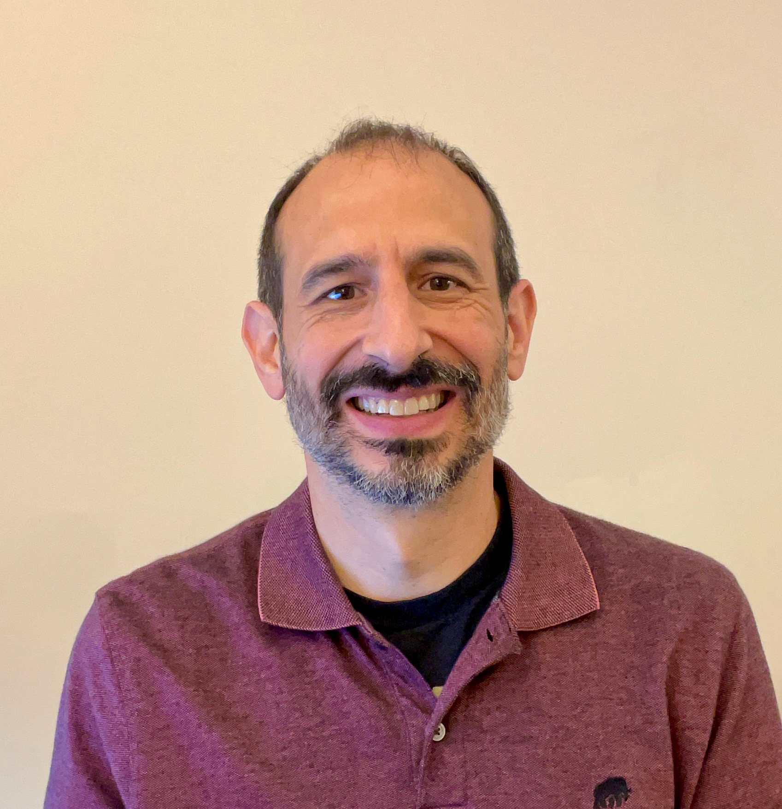
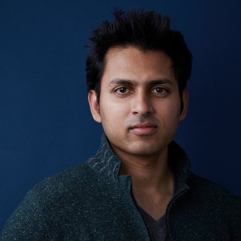
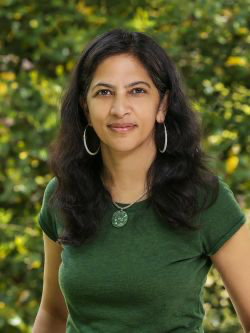
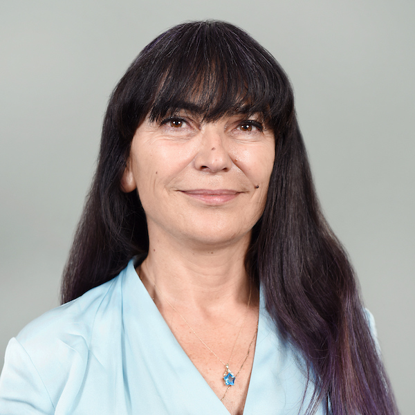
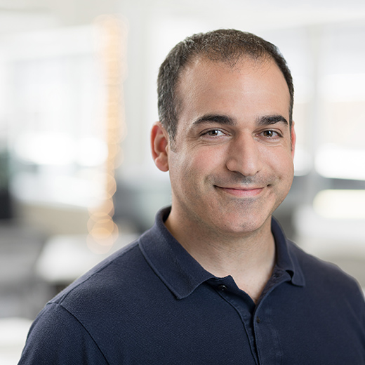
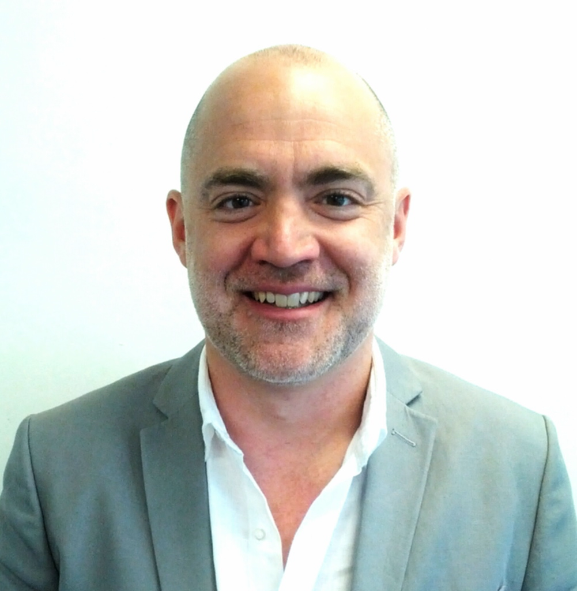

# Speakers

[**Christopher Amato**](https://www.khoury.northeastern.edu/home/camato/)  is an associate professor in the Khoury College of Computer Sciences at Northeastern University. His research is at the intersection of artificial intelligence, machine learning and robotics. Amato currently heads the Lab for Learning and Planning in Robotics, where his team works on planning and reinforcement learning in partially observable and multi-agent/multi-robot systems. Before joining Northeastern, he worked as a research scientist at Aptima Inc., a research scientist and postdoctoral fellow at MIT, and an assistant professor at the University of New Hampshire. Amato received his bachelor’s from Tufts University and his master’s and doctorate from the University of Massachusetts, Amherst. Amato is widely published in leading artificial intelligence, machine learning, and robotics conferences. He is the recipient of a best paper prize at AAMAS-14 and was nominated for the best paper at RSS-15, AAAI-19, and AAMAS-21. Amato has also successfully co-organized several tutorials on multi-agent planning and learning and has co-authored a book on the subject.

[**Beidi Chen**](https://www.andrew.cmu.edu/user/beidic/) is an Assistant Professor in the Department of Electrical and Computer Engineering at Carnegie Mellon University. She is a Visiting Research Scientist at FAIR, Meta. Before that, she was a postdoctoral scholar at Stanford University. She received her Ph.D. from Rice University in 2020 and B.S. from UC Berkeley in 2015. Her research focuses on efficient machine learning. Specifically, she designs and optimizes algorithms and models on modern hardware to accelerate large machine learning systems. Her work has won a best paper runner-up at ICML 2022, a best paper award at IISA 2018, and a best paper award at USENIX LISA 2014. She was selected as a Rising Star in EECS by MIT in 2019 and UIUC in 2021.

[**Soumith Chintala**](https://soumith.ch/) is an AI researcher at Meta and NYU, where he works on deep learning, reinforcement learning, generative image models, agents for video games and large-scale high-performance deep learning. Prior to joining Meta, he worked at MuseAmi, where he built deep learning models for music and vision targeted at mobile devices. He holds a Masters degree from NYU, and spent time in Yann LeCun’s NYU lab building deep learning models for pedestrian detection, natural image OCR, depth-images among others. Chintala co-founded PyTorch and has published influential research in areas such as Generative Adversarial Networks (GANs), co-authoring well-cited papers like LAPGAN, DCGAN, and Wasserstein GAN.

[**Radhika Nagpal**](https://www.radhikanagpal.org/)is the Norman R. Augustine '57 *59 Professor in Robotics at Princeton University, with joint appointments in the Departments of Mechanical and Aerospace Engineering and Computer Science. Previously, she was the Fred Kavli Professor of Computer Science at Harvard University and a founding faculty member of the Harvard Wyss Institute for Biologically Inspired Engineering. She earned her PhD at MIT, supported by the Bell Labs Fellowship, and later served as a postdoc at MIT. Nagpal has received numerous accolades, including the Microsoft New Faculty Fellowship, NSF Career Award, Radcliffe Fellowship, and recognition as an AAAI Fellow and ACM Fellow. She co-founded ROOT Robotics, which was acquired by iRobot, and developed the Kilobot swarm robots, now sold worldwide. 

[**Angelia Nedich**](https://faculty.engineering.asu.edu/nedich/) is a professor in the School of Electrical, Computer and Energy Engineering at Arizona State University. She has a doctorate from Moscow State University, Russia, in computational mathematics and mathematical physics (1994), and a doctorate from Massachusetts Institute of Technology in electrical and computer science engineering (2002). She has worked as a senior engineer in BAE Systems North America, Advanced Information Technology Division at Burlington, MA. Prior to joining Arizona State University, she was a faculty member at the University of Illinois at Urbana-Champaign. She has been a recipient of National Science Foundation (NSF) CAREER Award 2007 in operations research for her work in distributed multi-agent optimization. She is a recipient (jointly with her co-authors) of the Best Paper Award at the Winter Simulation Conference 2013 and the Best Paper Award at the International Symposium on Modeling and Optimization in Mobile, Ad Hoc and Wireless Networks (WiOpt) 2015. Also, she is a coauthor of the book "Convex Analysis and Optimization."

[**Michael Rabbat**](https://ai.meta.com/people/1148536089838617/michael-rabbat/) is a founding member of the Facebook AI Research (FAIR) team in Montreal. He holds a B.Eng. from the University of Illinois at Urbana-Champaign, a M.Eng from Rice University, and a Ph.D. in electrical engineering from the University of Wisconsin-Madison. Prior to Facebook, Mike was a professor at McGill University in the Department of Electrical and Computer Engineering. His research interests include optimization, distributed algorithms and signal processing.

[**Frank Wood**](https://www.cs.ubc.ca/~fwood/) is an associate professor of computer science at the University of British Columbia and a Canada CIFAR AI Chair at Mila. Before that Dr. Wood was an associate professor in the Department of Engineering Science at the University of Oxford and assistant professor of Statistics at Columbia University. He formerly was a postdoctoral fellow of the Gatsby Computational Neuroscience Unit of the University College London under Dr. Yee Whye Teh. He received his PhD from Brown University in computer science under the supervision of Dr. Michael Black and Dr. Tom Griffiths. Dr. Wood holds 7 patents, has authored over 80 papers, received the AISTATS best paper award in 2009, a best paper honorable mention at ICML 2019, and has been awarded faculty research awards from Xerox, Google and Amazon.

[**Ce Zhang**](https://zhangce.github.io/) is currently the CTO of Together.ai and a Neubauer Associate Professor at the University of Chicago. He was an Associate Professor in Computer Science at ETH Zurich. The mission of his research is to make machine learning techniques widely accessible-​​-​-while being cost-​efficient and trustworthy-​​-​-to everyone who wants to use them to make our world a better place. He believes in a system approach to enabling this goal, and his current research focuses on building next-​generation machine learning platforms and systems that are data-​centric, human-​centric, and declaratively scalable. Before joining ETH, Ce finished his PhD at the University of Wisconsin-​​Madison and spent another year as a postdoctoral researcher at Stanford, both advised by Christopher Ré. His work has received recognitions such as the SIGMOD Best Paper Award, SIGMOD Research Highlight Award, Google Focused Research Award, an ERC Starting Grant, and has been featured and reported by Science, Nature, the Communications of the ACM, and a various media outlets such as Atlantic, WIRED, Quanta Magazine, etc

